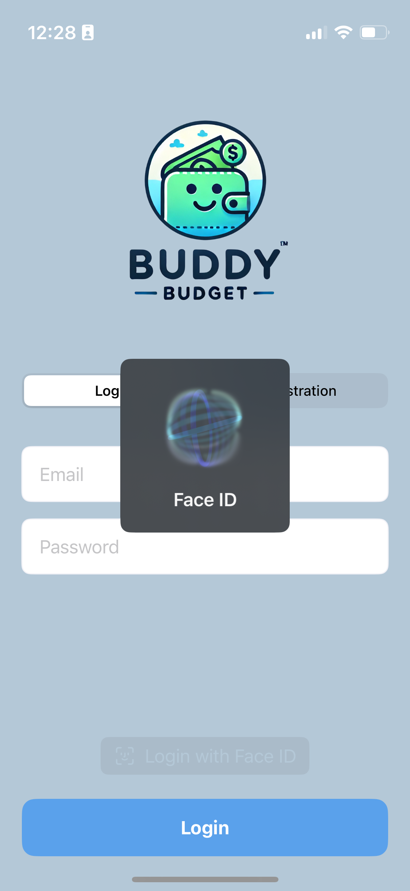

# BudgetBuddy 💰📊

**BudgetBuddy** is a simple iOS app for tracking income and expenses. It allows users to log their financial transactions, view basic statistics, and store data in Firebase.

<div style="display: flex; justify-content: center; gap: 10px;">
    
    
    
    
    
</div>

## 🚀 Features
✅ User authentication with automatic credential filling and password generation.       
✅ User FaceID/TouchID login autentification.      
✅ User Onbaording - setup wallet and basic categories.    

## 🔮 Future Features
🧑🏽‍💻 Add income and expenses  
🧑🏽‍💻 Categorize transactions  
🧑🏽‍💻 View statistics and spending trends  
🧑🏽‍💻 Cloud storage with Firebase  

## 🛠️ Tech Stack
- Swift 5 + SwiftUI
- Firebase Firestore (Cloud Database)
- Firebase Authentication
- Clean architecture by VIPER
- Charts & statistics

## 🔧 Installation
1. Clone the repository:
   ```bash
   git clone https://github.com/hajducak/BudgetBuddy.git
   ```
2. Use `main` branch only

## 🪪 Contribution

If you want to contribute to the project, fork the repository, create a new branch, make changes, and submit a pull request.
License

This project is available under the MIT license.
